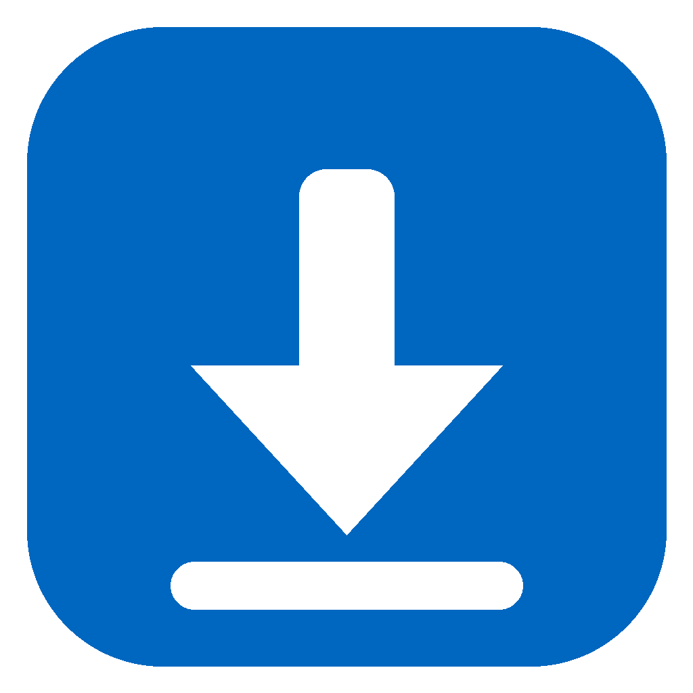
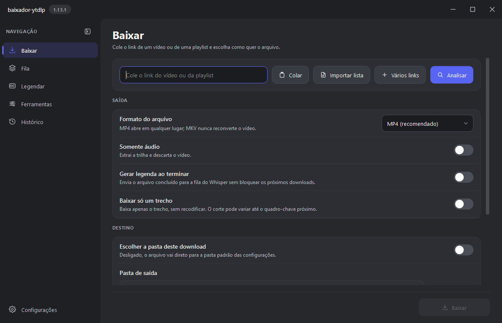
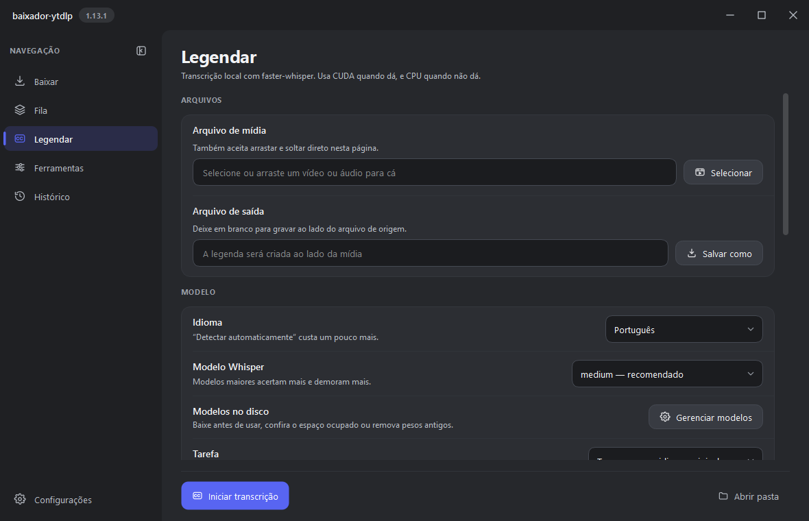
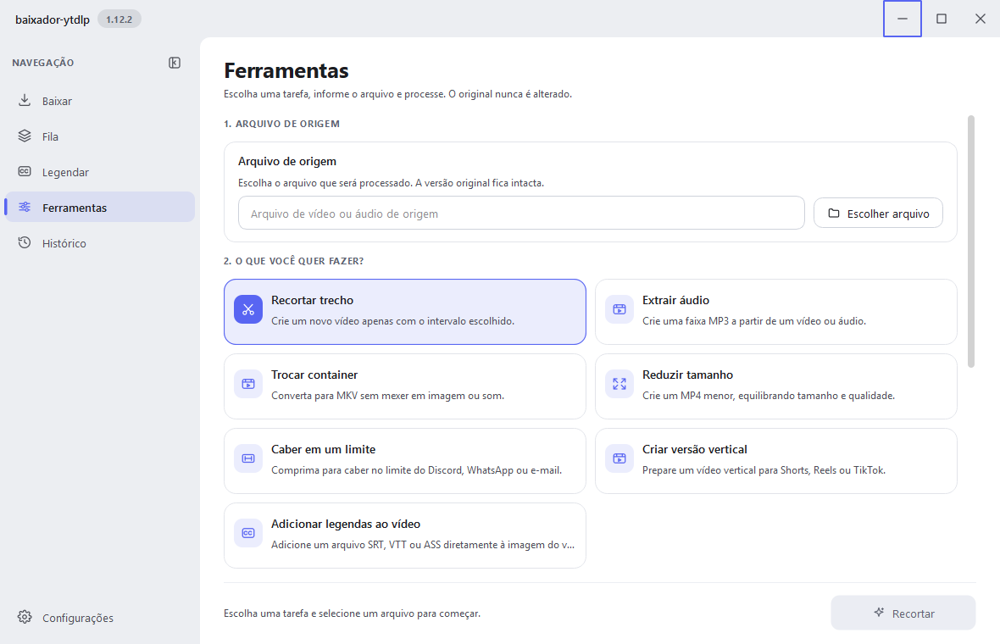
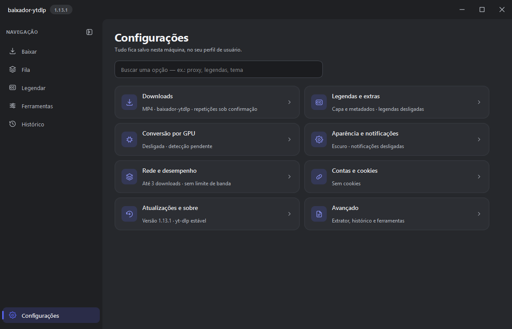

<div align="center">



# Baixador YT-DLP

**Baixe, transcreva e edite vídeos e áudios — tudo local, com aceleração por GPU.**

Interface moderna para o [yt-dlp](https://github.com/yt-dlp/yt-dlp), com transcrição por Whisper
e ferramentas de vídeo. Grátis, de código aberto e sem enviar nada para a nuvem.

[](https://github.com/NoThinkpls/baixador-ytdlp/releases/latest)
[](https://github.com/NoThinkpls/baixador-ytdlp/releases)
[](https://github.com/NoThinkpls/baixador-ytdlp/actions)
[](#-download)
[](LICENSE)

[**Download**](#-download) ·
[Recursos](#-recursos) ·
[Guia de uso](docs/GUIA-DE-USO.md) ·
[Changelog](CHANGELOG.md) ·
[English](README.en.md)

<br>



</div>

## ✨ Por que usar

- **Rápido de verdade.** Downloads com fragmentos em paralelo; trechos de vídeos longos do YouTube usam o formato HLS e são baixados em partes paralelas, emendadas sem recodificar: ~30× o tempo real (82 min de uma live em ~2,5 min).
- **Tudo no seu computador.** Transcrição, conversão e cortes rodam localmente. Nenhum áudio ou vídeo sai da sua máquina.
- **Usa a sua GPU.** NVIDIA (NVENC e CUDA), AMD (AMF e VAAPI), Intel (Quick Sync) e Apple Silicon (VideoToolbox e MLX), com retorno automático para a CPU se a GPU recusar a mídia.
- **Seguro por padrão.** yt-dlp, FFmpeg e Deno vêm das fontes oficiais com SHA-256 conferido; a validação de certificado TLS nunca é desligada.
- **Bonito e leve de usar.** Tema claro e escuro, português e inglês, fila persistente e avisos que não atrapalham.

## 📥 Download

| Seu sistema | Como usar | Download |
| --- | --- | --- |
| Windows 10/11 | Instalação normal, com atalho e atualização pelo app | [Baixar instalador](https://github.com/NoThinkpls/baixador-ytdlp/releases/latest/download/baixador-ytdlp-setup.exe) |
| Windows 10/11 | Sem instalar: dados e binários ficam na pasta extraída | [Baixar versão portable](https://github.com/NoThinkpls/baixador-ytdlp/releases/latest/download/baixador-ytdlp-portable-windows.zip) |
| Mac com M1, M2, M3 ou M4 | Abra o DMG e arraste para Aplicativos | [Baixar instalador para macOS](https://github.com/NoThinkpls/baixador-ytdlp/releases/latest/download/baixador-ytdlp-macos-arm64.dmg) |
| Mac com M1, M2, M3 ou M4 | Sem instalar: descompacte e abra o app | [Baixar versão portable para macOS](https://github.com/NoThinkpls/baixador-ytdlp/releases/latest/download/baixador-ytdlp-macos-arm64.zip) |
| Ubuntu 22.04+ / Debian 12+ (x86_64) | Instalação integrada ao sistema | [Baixar pacote `.deb`](https://github.com/NoThinkpls/baixador-ytdlp/releases/latest/download/baixador-ytdlp-linux-amd64.deb) |
| Linux x86_64 | Sem instalar: dados e binários ficam na pasta extraída | [Baixar versão portable](https://github.com/NoThinkpls/baixador-ytdlp/releases/latest/download/baixador-ytdlp-portable-linux-x86_64.tar.gz) |

> Os links usam os aliases estáveis da Release mais recente; a automação só cria ou atualiza a Release depois de validar todos os pacotes. Se a versão acabou de sair, aguarde a etapa **Publicar release** no [GitHub Actions](../../actions).

> **Nota:** os artefatos distribuídos atualmente não possuem certificado de assinatura de código. Por isso, Windows, macOS ou ferramentas de segurança podem exibir um aviso de aplicativo/desenvolvedor não reconhecido. Os arquivos oficiais do projeto são os publicados diretamente na seção [Releases](../../releases).

**Primeira abertura:** o app baixa yt-dlp, FFmpeg e Deno das fontes oficiais. Depois disso, cada componente só é baixado de novo quando existe versão nova (o FFmpeg, por exemplo, só quando sai um ramo estável mais recente).

## 🚀 Recursos

### Download

- Vídeo, áudio, playlists e **trechos** com escolha de qualidade e formato. O trecho não é recodificado; o início pode variar até o quadro-chave mais próximo.
- Análise prévia com miniatura, nome final estimado, tamanhos, codecs, idiomas de áudio e legendas manuais/automáticas.
- Vários links de uma vez, envio direto do navegador pelo protocolo `baixador://` e escolha dos itens de uma playlist.
- Fila persistente com **pausar e retomar**, retomada de arquivos parciais e novas tentativas automáticas.
- Capa, metadados e capítulos também em áudio; organização de músicas por canal/artista.
- Canal *nightly* do yt-dlp opcional, para correções de sites antes da versão estável.

### Legendas e transcrição

- Whisper local até o **Large v3 Turbo**, tradução para inglês e vocabulário de contexto.
- Saídas SRT, VTT, ASS, karaoke, TXT e JSON, para um ou vários arquivos e pastas de uma vez.
- Fluxo **Baixar e legendar**: ao terminar o download, o arquivo entra na fila do Whisper e pode receber a legenda como faixa, sem recodificar.
- CUDA nas placas NVIDIA; **MLX** na GPU do Apple Silicon; CPU otimizada nas demais.

<div align="center">

</div>

### Ferramentas de vídeo

- Recortar, extrair áudio, trocar contêiner sem perder qualidade, reduzir tamanho, **caber num limite** (Discord, WhatsApp, e-mail), criar versão vertical (Shorts/Reels) e adicionar legendas.
- Conversão por **NVENC, AMF ou VideoToolbox** quando disponível, com retorno para a CPU se a GPU falhar. O arquivo original nunca é alterado.

<div align="center">

</div>

### Interface

- Tema claro e escuro, **português e inglês**, barra lateral compacta e ícones próprios.
- Progresso na barra de tarefas do Windows, bandeja do sistema e opção de continuar em segundo plano.
- Atualização do app no Windows, com SHA-256 (e assinatura Ed25519 nas releases assinadas) conferido antes de instalar.

<div align="center">

</div>

## ⚙️ Aceleração por plataforma

| | Windows | macOS (Apple Silicon) | Linux |
| --- | --- | --- | --- |
| Conversão e cortes | NVIDIA NVENC · AMD AMF · Intel Quick Sync | VideoToolbox | NVENC · Intel Quick Sync · VAAPI (AMD/Intel) |
| Transcrição | NVIDIA CUDA · CPU | MLX na GPU · CPU | CPU/int8 |

O que vem a seguir (Intel QSV, VAAPI, decodificação por hardware, cortes em paralelo) está em [`docs/PLANO-OTIMIZACAO-PLATAFORMAS.md`](docs/PLANO-OTIMIZACAO-PLATAFORMAS.md).

## 🔒 Privacidade e segurança

- Nada é enviado a serviços externos além das requisições ao site de origem, às releases do GitHub e às fontes oficiais dos componentes.
- Componentes só são instalados quando o fornecedor publica um SHA-256 válido, e o hash é conferido antes de cada execução.
- Cookies, histórico e configurações ficam locais e são removidos do diagnóstico exportado, junto com senhas de proxy e tokens de URL.
- Cancelar ou fechar o app encerra a árvore de processos (yt-dlp, FFmpeg, Deno); nada fica órfão.
- Detalhes em [Plataformas, desempenho e segurança](docs/PLATAFORMAS-E-SEGURANCA.md) e na [política de segurança](SECURITY.md).

## 📚 Documentação

| | |
| --- | --- |
| [Guia de uso](docs/GUIA-DE-USO.md) | Do primeiro download às ferramentas e às legendas |
| [Plataformas e segurança](docs/PLATAFORMAS-E-SEGURANCA.md) | Desempenho, GPU e modelo de segurança |
| [Compilação e Releases](docs/COMPILACAO-E-RELEASE.md) | Build com Nuitka, CI e publicação |
| [Plano de correções](docs/PLANO-DE-CORRECOES.md) · [Pendências](PENDENCIAS.md) | O que foi feito e o que falta |
| [Changelog](CHANGELOG.md) | Histórico de versões |
| [Como contribuir](CONTRIBUTING.md) | Ambiente, testes e convenções |

## 🛠️ Desenvolvimento

```bash
python -m venv .venv
.venv/Scripts/pip install -r requirements-windows.lock   # ou requirements-macos/linux
python main.py                                            # abre o app
python -m unittest discover -s tests                      # testes (QT_QPA_PLATFORM=offscreen)
ruff check .
```

No Windows, `.\build.ps1` gera o executável com Nuitka (`-Installer` cria o instalador). Detalhes em [Compilação e Releases](docs/COMPILACAO-E-RELEASE.md).

## ⚖️ Licença e uso

O projeto usa [yt-dlp](https://github.com/yt-dlp/yt-dlp) e [FFmpeg](https://ffmpeg.org/). Baixe apenas conteúdo que você tenha direito de acessar e utilizar. O código deste repositório está sob a [licença MIT](LICENSE); as bibliotecas distribuídas mantêm suas próprias licenças, listadas em [THIRD_PARTY_NOTICES.md](THIRD_PARTY_NOTICES.md).
